# Requirements Module - Detailed Walkthrough

**Module**: Requirements Input
**Date**: 2025-12-12
**Tester**: Antigravity
**Screenshots**: 15 captured in `docs/walkthroughs/`

---

## Screenshots

### Wizard Flow

| #   | File                                      | Description                           |
| --- | ----------------------------------------- | ------------------------------------- |
| 01  | 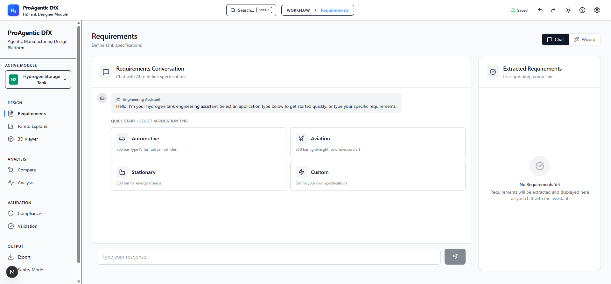            | Initial state - Chat tab selected     |
| 02  | 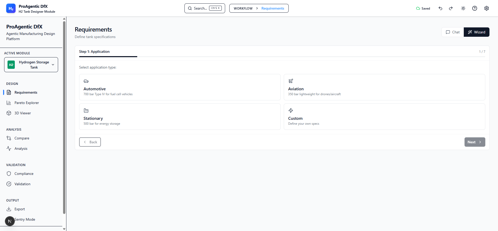         | Wizard Step 1 - Application selection |
| 03  | 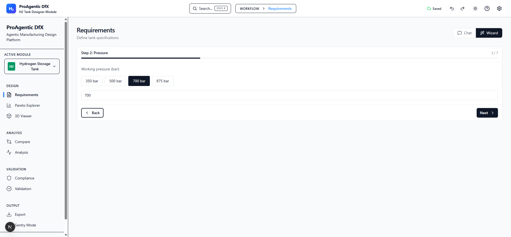             | Step 2 - Pressure (700 bar default)   |
| 04  | 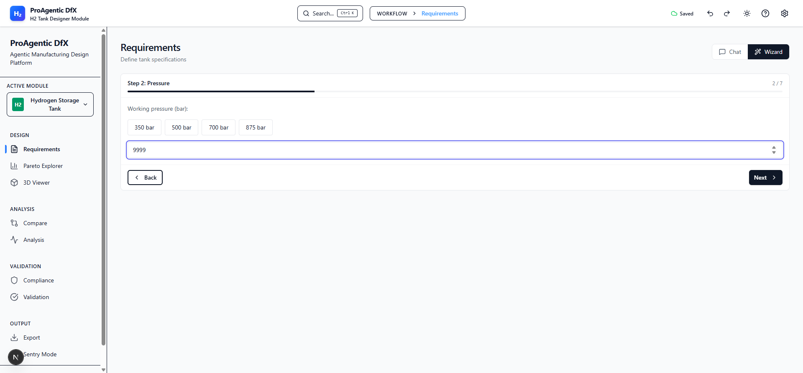   | **BUG**: 9999 bar accepted            |
| 05  | 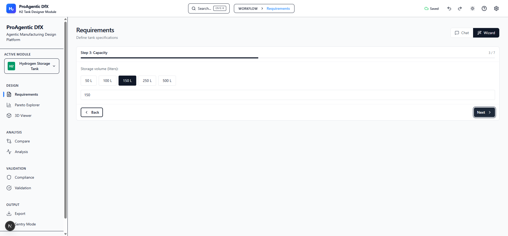          | Step 3 - Capacity                     |
| 06  | 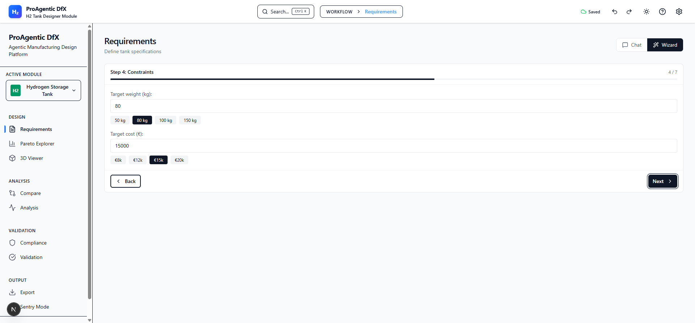    | Step 4 - Weight & Cost                |
| 07  | 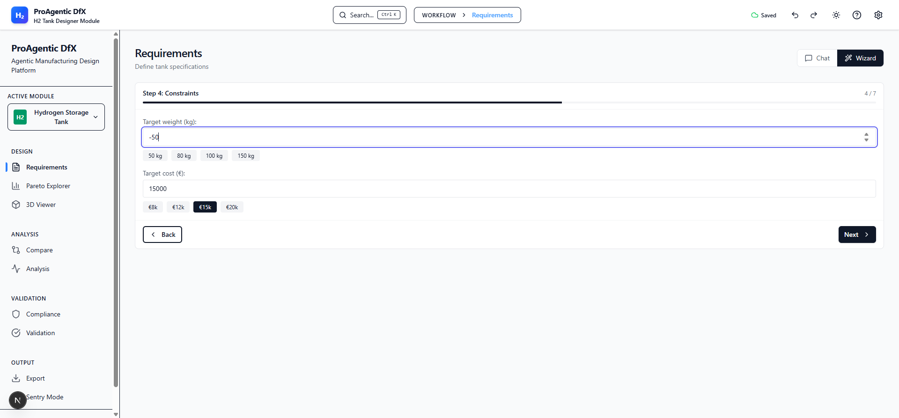   | **BUG**: -50kg accepted               |
| 08  | 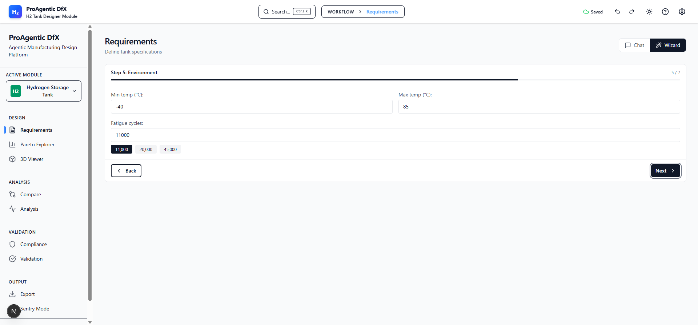    | Step 5 - Environment                  |
| 09  | 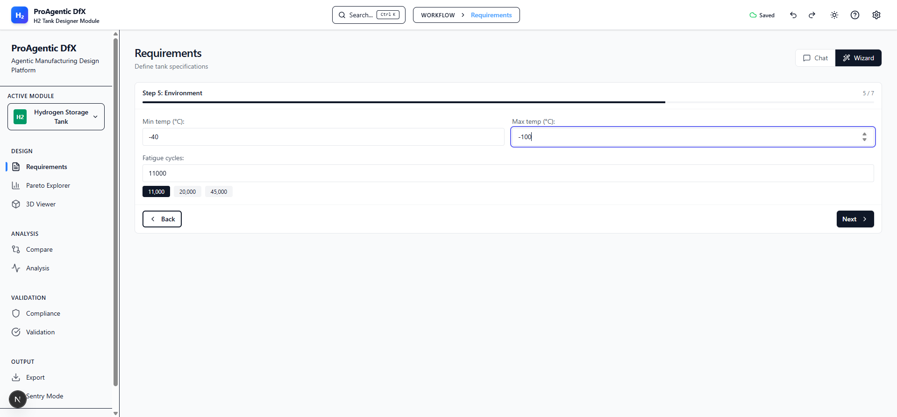 | **BUG**: Max temp &lt; Min temp       |
| 10  | 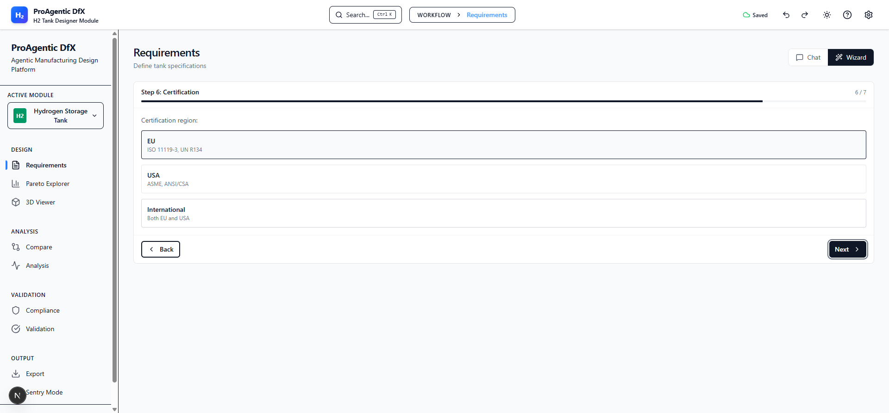         | Step 6 - Certification                |
| 11  | 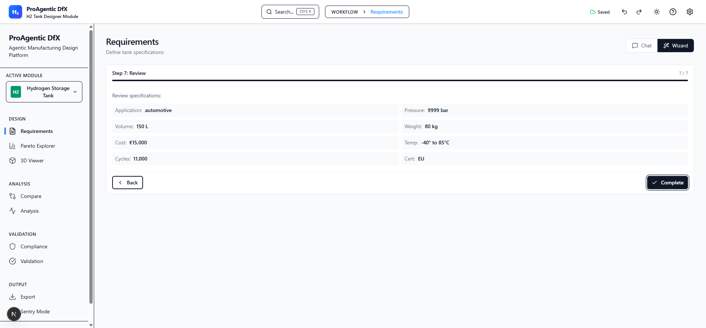      | Step 7 - Review (9999 bar carried)    |

### Chat Flow

| #   | File                                              | Description                  |
| --- | ------------------------------------------------- | ---------------------------- |
| 12  |                | Chat - Fresh state           |
| 13  | 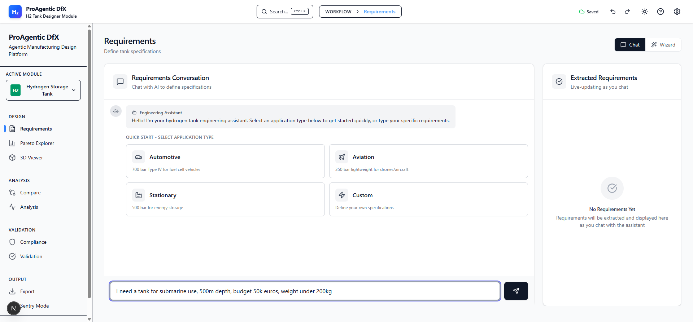               | Chat - Submarine query input |
| 14  | 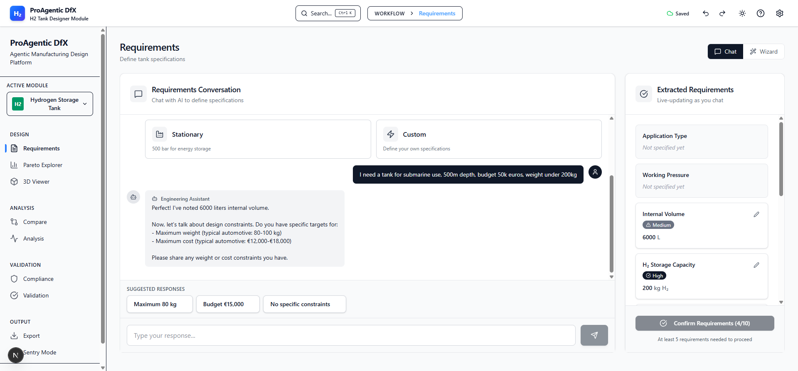 | **BUG**: 50k→50€ parsing     |
| 15  | 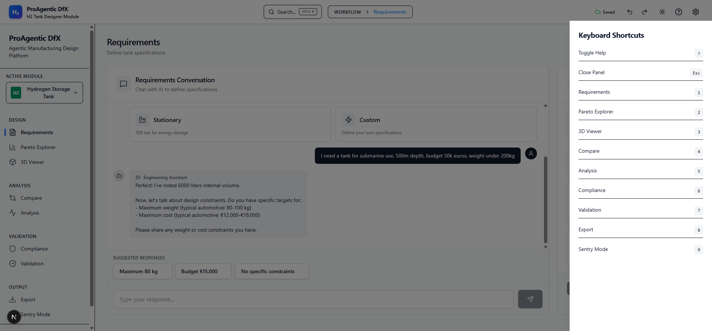                    | Help panel                   |

---

## Bugs Found

### CRITICAL: No Input Validation

| Bug ID  | Severity | Field    | Input              | Expected | Actual   | Screenshot |
| ------- | -------- | -------- | ------------------ | -------- | -------- | ---------- |
| VAL-001 | Critical | Pressure | 9999 bar           | Error    | Accepted | REQ_04     |
| VAL-002 | Critical | Weight   | -50 kg             | Error    | Accepted | REQ_07     |
| VAL-003 | Critical | Max Temp | -100°C (below min) | Error    | Accepted | REQ_09     |

### HIGH: AI Parsing Errors

| Bug ID | Severity | Issue                     | Example                             | Screenshot |
| ------ | -------- | ------------------------- | ----------------------------------- | ---------- |
| AI-001 | High     | "k" multiplier ignored    | "50k"→"50"                          | REQ_14     |
| AI-002 | High     | Weight/Capacity confusion | "200kg weight"→"200 kg H2 capacity" | REQ_14     |

---

## Features Working

- ✓ Tab switching (Chat/Wizard)
- ✓ Quick Start buttons
- ✓ Wizard navigation (Next/Back)
- ✓ Inline edit requirements
- ✓ Help panel with keyboard shortcuts
- ✓ All 7 wizard steps complete

---

## Recommendations

1. **Immediate**: Add input validation
   - Pressure: max 1000 bar
   - Weight: must be positive
   - Temperature: max must be > min

2. **High**: Fix AI parsing
   - Handle "k" multiplier (1k, 20k)
   - Distinguish weight vs H2 capacity
